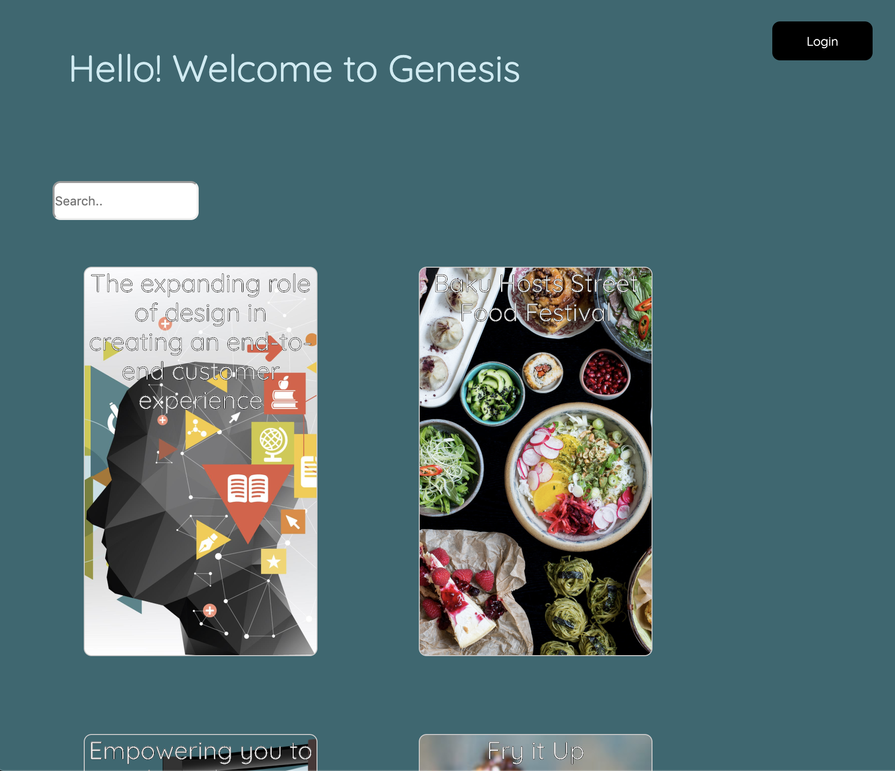
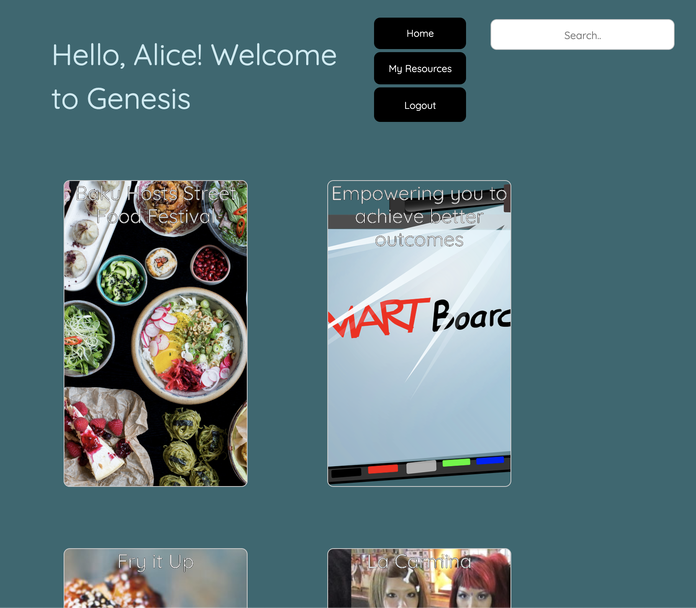
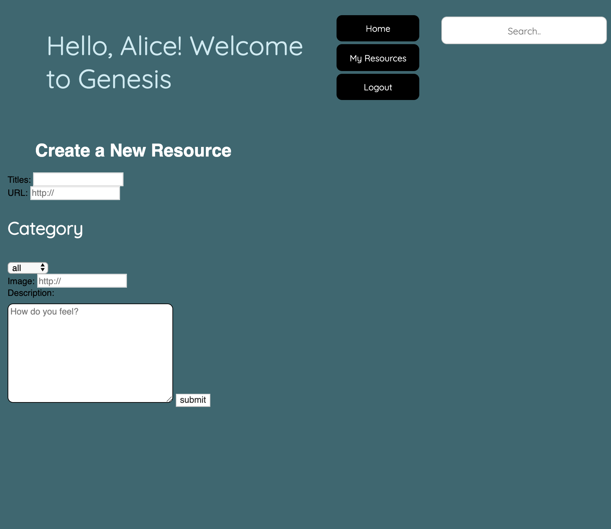
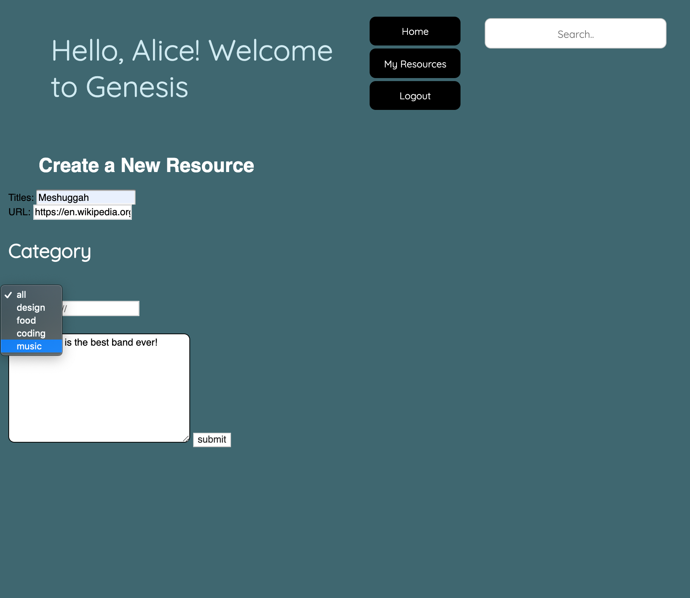
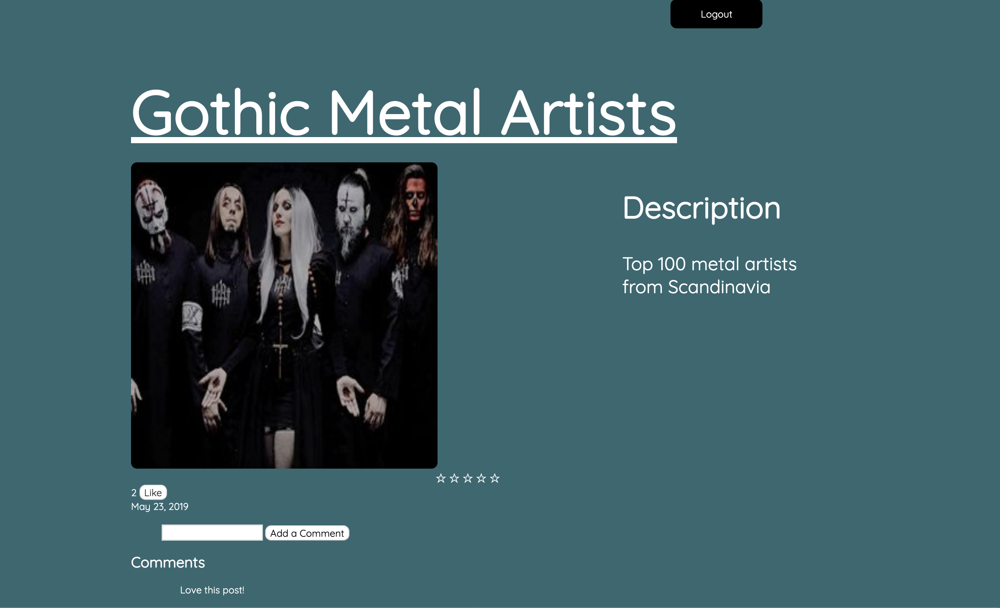

# Welcome to Genesis

-an interactive platform where users can save resources like tutorials, blogs and videos in a central place that is publicly available to anyone. Users are able to like, comment and rate resources as well as add their own resources and categories, the title of the post in the individual info page for each post links back to the original website.
**Search bar functionality to come**

##Screenshots

## Dependencies

-   Node 5.10.x or above
-   NPM 3.8.x or above
-   body parser
-   Express
